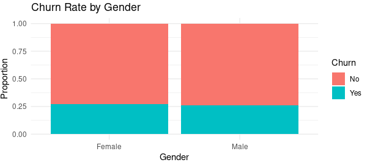
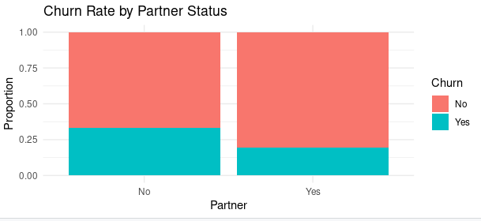
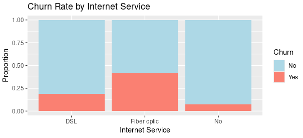
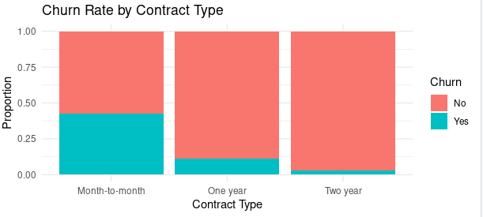
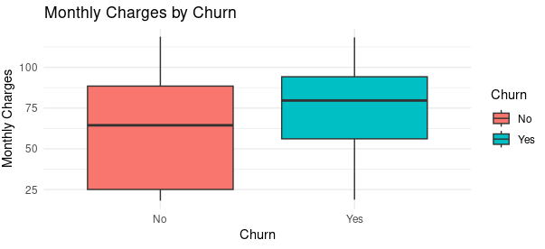
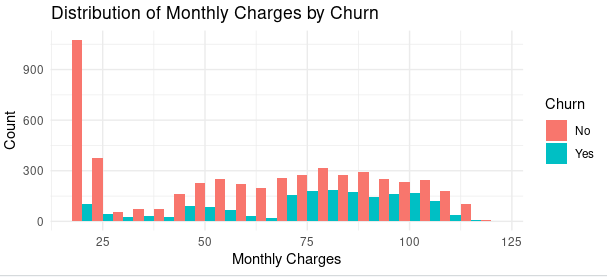
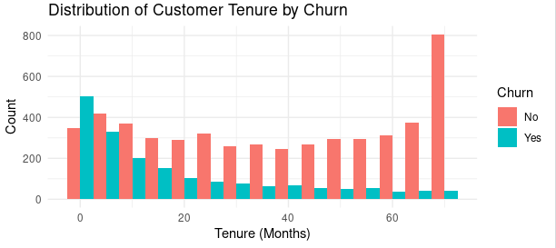

# Churn-Analysis-in-R
In this project, I conducted a comprehensive analysis of customer churn within the Telco industry using R. The analysis aimed to uncover key factors influencing customer retention and to quantify the churn rate.

## My Work on R Posit Cloud

You can view my work on R Posit Cloud at the following link:

[View](https://posit.cloud/content/8972502)

### follow with me step by step 

### 1. Install Packages and Load Libraries
In this analysis, I begin by installing and loading the necessary R packages for data manipulation, visualization, and cleaning.

```{r, message=FALSE, warning=FALSE}
# Install necessary packages if not already installed
install.packages("tidyverse")
install.packages("readr")
install.packages("dplyr")
install.packages("ggplot2")
install.packages("tidyr")
install.packages("data.table")
install.packages("stringr")
install.packages("lubridate")
install.packages("forcats")

# Load libraries
library(readr)      # For reading CSV files
library(dplyr)      # For data manipulation
library(ggplot2)    # For data visualization
library(tidyr)      # For reshaping and tidying data
library(data.table) # For efficient data manipulation
library(stringr)    # For string/text manipulation
library(lubridate)  # For working with dates
library(forcats)    # For working with factors data
```

### 2. Load the Telco Customer Churn dataset from my pc
```r
data <- read_csv("Telco_Customer_Churn.csv")
```
### 3. View the first few rows of the dataset
```r
head(data)
```
### Dataset Overview

This function displays the first six rows of the dataset. Here's what I see:

- **customerID**: Unique identifier for each customer.
- **gender**: Gender of the customer (Male, Female).
- **SeniorCitizen**: Indicates if the customer is a senior citizen (0 = No, 1 = Yes).
- **Partner**: Indicates if the customer has a partner (Yes or No).
- **Dependents**: Indicates if the customer has dependents (Yes or No).
- **tenure**: Number of months the customer has been with the company.
- **PhoneService**: Indicates if the customer has a phone service (Yes or No).
- **MultipleLines**: Indicates if the customer has multiple lines (Yes, No, or "No phone service").
- The remaining columns include details about internet service, security options, contracts, billing, and charges.


### 4. Data Summary

After, I checked the summary of the data
```r
summary(data)
```
### Summary Statistics

This function provides summary statistics for each column:

- **customerID**: It gives the length and class type.
- **gender, Partner, and Dependents**: It shows the length and class type.
- **SeniorCitizen**: It displays statistics like Min, Max, and Quartiles (1st, Median, 3rd), indicating that approximately 16% of customers are senior citizens (mean = 0.1621).
- **tenure**: It shows the range (0 to 72 months), with a median of 29 months.
- **MonthlyCharges and TotalCharges**: It provides Min, Max, and Quartiles. Notably, TotalCharges has some missing values (NA's).


### 5. Check the structure of the dataset 
```r
str(data)
```
### Dataset Structure

This function displays the structure of the dataset:

- **spc_tbl_**: Indicates that it's a special type of tibble (a modern take on data frames in R).
- The dataset has **7,043 rows** and **21 columns**.
- Each column is listed with its name, data type (e.g., `chr` for character, `dbl` for double/numeric), and a sample of its content.
  

### Next Steps
Now I can proceed with the following 

### 6. Check for missing values in the dataset

```r
colSums(is.na(data))
```
TotalCharges has 11 missing values
since it is small number i will delete the 11 rows and continue cleaning

### 7. delete the 11 row 

```r
data <- na.omit(data)
```
### 8. calculate messing values after deleting to make sure there is no missing data

```r
colSums(is.na(data))
```
no missing data 

### 9. Calculate Churn Rate
```r
churn_rate <- sum(data$Churn == "Yes") / nrow(data)
print(churn_rate)
```
[1] 0.265785

## Churn Rate Analysis

I noticed a high churn rate, so let's check for every factor to figure out the problem.


## Visualizing Churn by Categorical Variables

### 1. Create a Bar Plot for Gender and Churn:

```r
# i Load the ggplot2 package
# Create a bar plot for Churn by Gender
ggplot(data, aes(x = gender, fill = Churn)) +
  geom_bar(position = "fill") +  # 'fill' stacks the bars proportionally
  labs(title = "Churn Rate by Gender", x = "Gender", y = "Proportion") +
  theme_minimal()
```
  

 There is no difference in churn rate between male and female customers.


### 2. Create a Bar Plot for Partner and Churn

```r
# Create a bar plot for Churn by Partner
ggplot(data, aes(x = Partner, fill = Churn)) +
  geom_bar(position = "fill") +  # 'fill' stacks the bars proportionally
  labs(title = "Churn Rate by Partner Status", x = "Partner", y = "Proportion") +
  theme_minimal()
```
  
 
 There is no difference in churn rate between customers with and without partners.


### 3. Create a Bar Plot for Internet Service and Churn

```r
# Create a bar plot for Churn by Internet Service
ggplot(data, aes(x = InternetService, fill = Churn)) +
    geom_bar(position = "fill") +  # 'fill' stacks the bars proportionally
    labs(title = "Churn Rate by Internet Service Type", x = "Internet Service Type", y = "Proportion") +
    theme_minimal()
```
  

 The churn rate is highest for customers using Fiber optic internet, followed by DSL. Customers with No internet service have the lowest churn rate.

### 4. Create a Bar Plot for Contract Type and Churn

```r
# Create a bar plot for Churn by Contract Type
ggplot(data, aes(x = Contract, fill = Churn)) +
  geom_bar(position = "fill") +  # 'fill' stacks the bars proportionally
  labs(title = "Churn Rate by Contract Type", x = "Contract Type", y = "Proportion") +
  theme_minimal()
```
 

Customers with Month-to-Month contracts have the highest churn rate, followed by One Year contracts. Customers with Two Year contracts have the lowest churn rate.

### 5. Create a Box Plot for MonthlyCharges and Churn

Since MonthlyCharges is a numeric variable, we can use a box plot to compare the distribution of monthly charges for customers who churned versus those who did not.

```r
# Create a box plot for MonthlyCharges by Churn
ggplot(data, aes(x = Churn, y = MonthlyCharges, fill = Churn)) +
    geom_boxplot() +
    labs(title = "Monthly Charges by Churn", x = "Churn", y = "Monthly Charges") +
    theme_minimal()
```
 

 Histogram
# 6. Create a histogram for MonthlyCharges by Churn

```r
ggplot(data, aes(x = MonthlyCharges, fill = Churn)) +
  geom_histogram(binwidth = 5, position = "dodge") +
  labs(title = "Distribution of Monthly Charges by Churn", x = "Monthly Charges", y = "Count") +
  theme_minimal()
```
 

slightly higher concentration of churners in the higher monthly charge ranges.

### 7. Create a Histogram for Tenure and Churn
I will ll use facet_wrap() to create two histograms one for customers who churned and one for those who didn’t, making it easier to compare the distributions.

```r
# Create a histogram for tenure by Churn
ggplot(data, aes(x = tenure, fill = Churn)) +
  geom_histogram(binwidth = 5, position = "dodge") +
  labs(title = "Distribution of Customer Tenure by Churn", x = "Tenure (Months)", y = "Count") +
  theme_minimal()
```
 

The chart reveals that the majority of customers who churn have been with the company for less than 10 months. As tenure increases, the proportion of customers who churn decreases.


### Create a Summary Table for Churn by Categorical Variables

In this step, we will create a pivot table to compare the `Churn` status based on several categorical variables, such as `gender`, `SeniorCitizen`, and `InternetService`. This will help us understand how these factors affect the likelihood of customer churn.

```r
# Create a summary table for churn by categorical variables
library(dplyr)

summary_table <- data %>%
    group_by(gender, SeniorCitizen, InternetService, Churn) %>%
    summarise(Count = n()) %>%
    spread(Churn, Count, fill = 0)

# Print the summary table
print(summary_table)
```

### Summary Table for Churn by Categorical Variables

| gender | SeniorCitizen | InternetService | No  | Yes |
|--------|---------------|-----------------|-----|-----|
| Female | 0             | DSL             | 880 | 181 |
| Female | 0             | Fiber optic     | 664 | 465 |
| Female | 0             | No              | 672 | 53  |
| Female | 1             | DSL             | 85  | 38  |
| Female | 1             | Fiber optic     | 225 | 199 |
| Female | 1             | No              | 18  | 3   |
| Male   | 0             | DSL             | 896 | 200 |
| Male   | 0             | Fiber optic     | 697 | 439 |
| Male   | 0             | No              | 688 | 55  |
| Male   | 1             | DSL             | 96  | 40  |
| Male   | 1             | Fiber optic     | 213 | 194 |
| Male   | 1             | No              | 29  | 2   |

## Analysis of Results:
1. **Gender**:
   - Both females and males with `Fiber optic` service have higher churn rates compared to those with `DSL` or `No Internet`.
   - Customers with `No Internet`, whether male or female, have very low churn rates.

2. **Senior Citizens**:
   - Senior citizens using `Fiber optic` have significantly higher churn rates compared to those using `DSL` or without internet.
   - Senior citizens with fiber optic services are more likely to churn than those without it.


### Analyzing Gender and Churn

To investigate how gender influences churn
 table for gender vs. churn:

```r
# Contingency table for Gender vs. Churn
gender_churn_table <- table(data$gender, data$Churn)
print(gender_churn_table)
```
| Gender | No   | Yes  |
|--------|------|------|
| Female | 2549 | 939  |
| Male   | 2625 | 930  |
```r
# Rate of churn across genders
gender_churn_prop <- prop.table(gender_churn_table, margin=1)
print(gender_churn_prop)
```
| Gender | No        | Yes       |
|--------|-----------|-----------|
| Female | 0.7307913 | 0.2692087 |
| Male   | 0.7383966 | 0.2616034 |

Female Churn Proportions:
73.08% of females did not churn, while 26.92% churned.
Male Churn Proportions:
73.84% of males did not churn, while 26.16% churned.

### Analyzing Contract Type and Churn

To investigate how contract type influences churn.

```r
# Contingency table for Contract type vs. Churn
contract_churn_table <- table(data$Contract, data$Churn)
print(contract_churn_table)
```
### Contingency Table for Contract Type vs. Churn

| Contract Type     | No  | Yes |
|-------------------|-----|-----|
| Month-to-month    | 2220| 1655|
| One year          | 1307| 166 |
| Two year          | 1647| 48  |
```r
# Proportional distribution of churn across contract types
contract_churn_prop <- prop.table(contract_churn_table, margin=1)
print(contract_churn_prop)
```
### Proportional Distribution of Churn Across Contract Types

| Contract Type     | No        | Yes        |
|-------------------|-----------|------------|
| Month-to-month    | 0.57290323| 0.42709677 |
| One year          | 0.88730482| 0.11269518 |
| Two year          | 0.97168142| 0.02831858 |
### Explanation
- The **contingency table** indicates how many customers of each contract type did or did not churn.
- The **proportional distribution** shows the percentage of churn within each contract type. For example:
  - **Month-to-month** contracts have a churn rate of approximately **42.71%**.
  - **One year** contracts have a lower churn rate of approximately **11.27%**.
  - **Two year** contracts have the lowest churn rate at approximately **2.83%**.

This analysis suggests that customers with **month-to-month** contracts tend to churn more frequently compared to those with longer contract commitments.

### Logistic Regression Model Summary

The logistic regression model was built to predict Churn based on various predictors. Below is the summary of the model:

```r
glm(formula = Churn ~ gender + SeniorCitizen + Partner + Dependents + 
    tenure + InternetService + Contract + PaymentMethod + MonthlyCharges + 
    TotalCharges, family = binomial, data = data)
```

### Statistically Significant Effect on Churn


| Variable                                      | Estimate   | Std. Error    | z Value  | p-value                |
|-----------------------------------------------|------------|----------------|----------|------------------------|
| (Intercept)                                   | -0.05049   | 0.2179         | -0.232   | 0.816777               |
| Gender (Male)                                 | -0.01768   | 0.06385        | -0.277   | 0.781920               |
| Senior Citizens                               | 0.3049     | 0.08284        | 3.681    | 0.000233               |
| Partner (Yes)                                 | 0.01215    | 0.07658        | 0.159    | 0.873926               |
| Dependents (Yes)                             | -0.1874    | 0.08848        | -2.118   | 0.034199               |
| Tenure                                        | -0.05932   | 0.006253       | -9.488   | < 2e-16                |
| Internet Service (Fiber Optic)               | 0.9501     | 0.1308         | 7.263    | 3.80e-13               |
| Internet Service (No)                         | -0.9446    | 0.1575         | -5.997   | 2.01e-09               |
| Contract (One Year)                          | -0.7488    | 0.1052         | -7.117   | 1.11e-12               |
| Contract (Two Year)                          | -1.554     | 0.1740         | -8.935   | < 2e-16                |
| Payment Method (Credit Card Automatic)       | -0.07303   | 0.1124         | -0.650   | 0.515774               |
| Payment Method (Electronic Check)            | 0.4105     | 0.09267        | 4.430    | 9.41e-06               |
| Payment Method (Mailed Check)                | -0.1103    | 0.1128         | -0.978   | 0.328154               |
| Monthly Charges                               | -0.004313  | 0.003502       | -1.231   | 0.218198               |
| Total Charges                                 | 0.0003347  | 0.00007055     | 4.744    | 2.09e-06               |

### Analysis of Results

- **Significant Variables:**
  - **SeniorCitizen**: p-value = 0.000233 . This indicates that being a senior citizen increases the churn.
  - **Tenure**: p-value < 2e-16 . This suggests that the length of a customer's subscription negatively affects the churn; as tenure increases, the churn decreases.
  - **InternetService (Fiber Optic)** and **InternetService (No)**: Both have a significant impact on churn. Using fiber optic internet increases the likelihood of churn, while not using the service decreases it.
  - **Contract Type**: Short-term contracts such as a one-year contract are associated with an increased the churn.

- **Non-significant Variables:**
  - **Partner** and **Dependents**: These do not show a significant effect on the likelihood of churn, as their p-values are greater than 0.05.

- From these results, certain variables, such as age, tenure, and service type, significantly influence the customer churn. this information can be valuable for marketing strategies and improving customer service.
- On the other hand, service providers can focus on enhancing the experience of customers with short-term contracts and those using specific types of services (such as fiber optics).

# Conclusion

In this analysis of customer churn for a telecommunications company, several key insights were derived from the Telco Customer Churn dataset. The analysis utilized various data manipulation and visualization techniques in R to explore the factors influencing customer churn.

## Key Findings

1. **Churn Rate**: The overall churn rate was calculated at approximately **26.58%**, indicating a significant proportion of customers are leaving the service.

2. **Impact of Gender**: The analysis showed that both male and female customers had similar churn rates, with females exhibiting a churn rate of **26.92%** and males at **26.16%**. This suggests that gender may not be a primary factor influencing churn.

3. **Influence of Partner and Dependents**: Customers without partners and dependents were found to have higher churn rates. This highlights the importance of personal circumstances in customer retention.

4. **Contract Type**: The type of contract had a profound impact on churn rates. Customers on **month-to-month** contracts had a churn rate of approximately **42.71%**, while those on **two-year contracts** exhibited a churn rate of only **2.83%**. This indicates that longer contracts may lead to greater customer retention.

5. **Internet Service Type**: Customers with **fiber optic** internet services experienced higher churn rates compared to those with **DSL** or **no internet** services. This suggests potential issues with fiber optic service quality or customer satisfaction.

6. **Monthly Charges and Tenure**: The analysis revealed that customers with higher monthly charges tended to churn more frequently. Additionally, tenure played a crucial role, with customers who had longer tenures being less likely to churn.

## Recommendations

Based on these findings, the following recommendations can be made to reduce churn rates:

- **Enhance Customer Engagement**: Develop targeted marketing strategies to engage customers, especially those on month-to-month contracts.
- **Improve Service Quality**: Focus on improving the quality of fiber optic services to reduce dissatisfaction among customers.
- **Incentivize Longer Contracts**: Offer promotions or incentives to encourage customers to switch to longer-term contracts, thereby increasing retention.
- **Monitor Key Metrics**: Continuously monitor churn rates and customer feedback to identify trends and areas for improvement.

Overall, this project underscores the importance of data analysis in understanding customer behavior and informing strategic business decisions to enhance customer retention and satisfaction.

## My Work on R Posit Cloud

You can view my work on R Posit Cloud at the following link:

[View](https://posit.cloud/content/8972502)

You can also load the data from here 

[View](Telco_Customer_Churn.csv)


